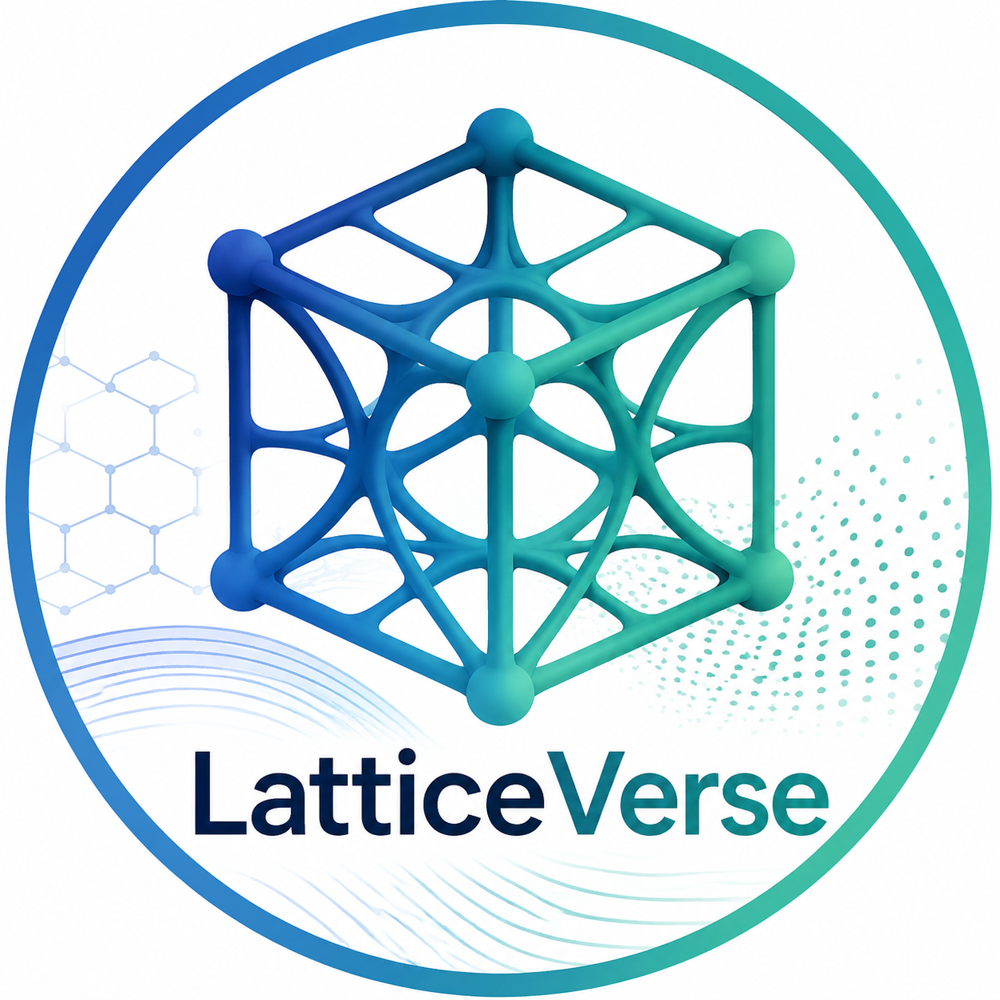
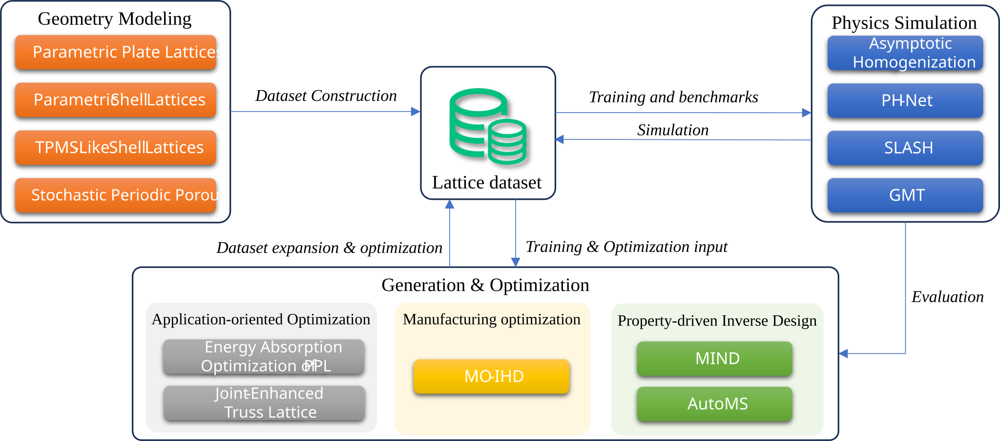

<div align="center">

  

  <p><strong>A unified codebase for computational lattice modeling, physics simulation, inverse design, and manufacturing-aware optimization.</strong></p>

[Research Map](#research-map) · [Project Zoo](#project-zoo) · [Repository Layout](#repository-layout) · [Integration Contract](#integration-contract)

</div>

> [!NOTE]
> LatticeVerse is currently being consolidated from a collection of research codebases. The papers and verified standalone repositories are indexed below; a unified installation will accompany the first tagged release.

## Overview

LatticeVerse connects four parts of the lattice-design workflow that are often developed in isolation:

1. **Geometry** — compact, controllable families of truss, plate, shell, TPMS-like, and stochastic porous lattices.
2. **Physics** — homogenization and learned numerical solvers that recover effective properties and local physical fields.
3. **Design** — property-conditioned generation, multi-objective optimization, and agentic search.
4. **Deployment** — manufacturability constraints, application-specific objectives, and simulation/experiment validation.

The central abstraction is not a particular network or geometry family. It is a shared **lattice data layer** that allows any generator, simulator, or optimizer to exchange geometry, material, field, property, and manufacturing information through stable schemas.

## Research Map

<p align="center">
  
</p>

This map also captures the historical progression of the work:

- **2021–2022:** establish a trustworthy homogenization baseline, then learn displacement fields with PH-Net.
- **2022–2023:** expand the design space through parametric shell, plate, and TPMS-like families.
- **2025:** move toward application-specific optimization, stochastic/fabricable geometry, high-resolution solvers, and generative inverse design.
- **2026:** couple numerical rigor with transformers, multi-agent search, cross-physics objectives, and differentiable manufacturing constraints.

## Project Zoo

### Geometry and parametric modeling

| Year / Venue | Project | What it contributes | Resources |
|:---|---|---|---|
| 2022 · [AM](https://www.sciencedirect.com/journal/additive-manufacturing) | **PSL** | A skeleton-driven parametric shell representation with controllable topology and morphology; integrates with shape optimization for tailored elastic properties. | [Paper](https://doi.org/10.1016/j.addma.2022.103258) · integration planned |
| 2023 · [AM](https://www.sciencedirect.com/journal/additive-manufacturing) | **PPL** | A unified parametric plate-lattice representation with direct quadrilateral meshing and level-set shape optimization. | [Paper](https://doi.org/10.1016/j.addma.2023.103626) · integration planned |
| 2023 · [AM](https://www.sciencedirect.com/journal/additive-manufacturing) | **TPMS-like** | New shell-lattice families obtained from parametric periodic boundaries and minimal-surface construction, extending the property space beyond classical TPMS formulas. | [Paper](https://doi.org/10.1016/j.addma.2023.103779) · integration planned |
| 2025 · [AM](https://www.sciencedirect.com/journal/additive-manufacturing) | **SPPM** | Fabricable stochastic periodic porous microstructures built with Wang-cube rules and Gaussian kernels, balancing global randomness with periodic connectivity. | [Paper](https://doi.org/10.1016/j.addma.2025.104739) · integration planned |
| 2025 · [M&D](https://www.sciencedirect.com/journal/materials-and-design) | **PETL** | Parametric joint-enhanced truss lattices that redistribute material around joints to reduce stress concentrations and improve strength and stiffness. | [Paper](https://doi.org/10.1016/j.matdes.2025.113969) · integration planned |

### Physics and homogenization

| Year / Venue | Project | What it contributes | Resources |
|:---|---|---|---|
| 2021 · [C&G](https://www.sciencedirect.com/journal/computers-and-graphics) | **AH / MPP** | The deterministic reference layer: asymptotic homogenization plus mechanical-property profiles covering stiffness, strength, directional response, and worst-case stress. | [Paper](https://doi.org/10.1016/j.cag.2021.07.021) · integration planned |
| 2022 · [AM](https://www.sciencedirect.com/journal/additive-manufacturing) | **PH-Net** | A label-free 3D CNN that predicts microscopic displacement fields for general parallelepiped cells and derives homogenized and local properties from them. | [Paper](https://doi.org/10.1016/j.addma.2022.103237) · [Code](https://github.com/xing-yuu/phnet) |
| 2025 · [arXiv](https://arxiv.org/) | **CGiNS** | A sparse, periodic, multilevel neural solver informed by preconditioned conjugate-gradient iterations for physically consistent homogenization up to high resolutions. | [Paper](https://arxiv.org/abs/2506.17087) · integration planned |
| 2026 · [SIGGRAPH](https://s2026.siggraph.org/) | **GMT** | A Geometric Multigrid Transformer that aligns sparse Point Transformer blocks with multigrid hierarchies for high-fidelity elastic and thermal homogenization. | [Paper](https://arxiv.org/abs/2604.26518) · [Code](https://github.com/xing-yuu/GMT) |

### Inverse design, manufacturing, and applications

| Year / Venue | Project | What it contributes | Resources |
|:---|---|---|---|
| 2025 · [C&S](https://www.sciencedirect.com/journal/computers-and-structures) | **Energy-absorbing PPL** | An application-oriented pipeline combining nonlinear simulation, an MLP surrogate, and NSGA-II to balance specific energy absorption and peak crushing force. | [Paper](https://doi.org/10.1016/j.compstruc.2025.107880) · integration planned |
| 2025 · [SIGGRAPH](https://s2025.siggraph.org/) | **MIND** | A latent-diffusion inverse-design model using a symmetry-aware Holoplane representation to jointly encode geometry and physical response across lattice classes. | [Paper](https://doi.org/10.1145/3721238.3730682) · [Code](https://github.com/TimHsue/MIND) |
| 2026 · [ICML](https://icml.cc/Conferences/2026) | **AutoMS** | A multi-agent neuro-symbolic system with simulation-aware evolutionary search for cross-physics inverse microstructure design. | [Paper](https://arxiv.org/abs/2603.27195) · integration planned |
| 2026 · arXiv | **MO-IHD** | Manufacturing-constrained inverse homogenization with differentiable overhang, enclosed-cavity, and powder-removal constraints, plus progressive Pareto-front construction. | manuscript forthcoming · integration planned |


## End-to-End Workflows

### Forward characterization

`lattice family → canonical geometry → homogenization solver → local fields + effective properties → mechanical-property profile`

Use this path to compare lattice families under a common material model, boundary convention, discretization, and evaluation protocol.

### Property-driven inverse design

`target properties → MIND or AutoMS → CGiNS/GMT verification → ranking and diversity filtering → candidate lattices`

The generator proposes candidates; the solver is the source of physical truth. This separation reduces physical hallucination and makes every result reproducible.

### Manufacturing-aware optimization

`performance targets + build constraints → MO-IHD → manufacturable Pareto set → mesh/export → experiment`

Manufacturability is represented as an optimization constraint, not as a final repair step.

### Application-oriented optimization

`parametric family → high-fidelity application simulation → surrogate/Pareto search → fabrication → physical validation`

The energy-absorption study is the first reference pipeline for nonlinear, application-level objectives.

## Unified Data Layer

Every sample should have a versioned manifest with four groups of fields:

| Group | Minimum contents |
|---|---|
| Geometry | family and parameter values; cell basis; periodicity; SDF/voxel reference; surface or volume mesh reference; volume fraction |
| Physics | base material; governing physics; boundary conditions; discretization; local displacement/stress/flux fields; homogenized tensors; solver tolerance |
| Design | target properties; objective and constraint definitions; optimization history; random seed; parent/provenance identifiers |
| Manufacturing | process and build direction; minimum feature size; overhang score; cavity and powder-removal checks; export settings |

Raw datasets and checkpoints should be stored in versioned external releases. This repository should contain schemas, download manifests, checksums, preprocessing code, and small test fixtures rather than untracked binary dumps.

## Repository Layout

```text
LatticeVerse/
├── latticeverse/                 # Stable, reusable library code
│   ├── geometry/                 # Parametric families and representations
│   │   ├── truss/
│   │   ├── plate/
│   │   ├── shell/
│   │   └── porous/
│   ├── physics/                  # AH, assembly, boundary conditions, solvers
│   ├── design/                   # Optimization, generation, and search
│   ├── manufacturing/            # AM constraints and export checks
│   ├── data/                     # Schemas, adapters, and transforms
│   └── evaluation/               # Common metrics and benchmarks
├── projects/                     # Paper-specific implementations
│   ├── phnet/
│   ├── cgins/
│   ├── gmt/
│   ├── mind/
│   ├── automs/
│   └── mo_ihd/
├── configs/                      # Reproducible experiment configurations
├── examples/                     # Small end-to-end examples
├── tools/                        # Training, evaluation, conversion, export
├── docs/                         # Tutorials, theory notes, and paper pages
├── tests/                        # Unit, regression, and physics-consistency tests
└── assets/                       # README figures and lightweight media
```

Paper-specific code starts under `projects/`. A component is promoted into `latticeverse/` only after its interface, tests, license, and data contract are stable. This prevents the unified repository from becoming a flat collection of incompatible code drops.

## Integration Contract

Each integrated project must provide:

- a project README with paper, citation, license, and tested environment;
- configuration files for every reported benchmark;
- an adapter to the unified geometry and sample manifests;
- one lightweight smoke test and, where required, one GPU regression test;
- checkpoint and dataset manifests with checksums, rather than undocumented download links;
- a minimal inference or optimization example with deterministic output;
- explicit units, coordinate conventions, tensor ordering, and boundary conditions.

## Roadmap

- [ ] **Foundation:** freeze schemas, coordinate conventions, units, and asymptotic-homogenization baselines.
- [ ] **Geometry:** integrate PPL, PSL, TPMS-like, SPPM, and PETL generators behind a common API.
- [ ] **Solvers:** migrate PH-Net, CGiNS, and GMT with shared preprocessing and evaluation.
- [ ] **Design:** connect MIND, AutoMS, and MO-IHD to the same target/constraint specification.
- [ ] **Benchmarks:** publish cross-family accuracy, speed, generalization, and manufacturability protocols.
- [ ] **Applications:** release reproducible energy-absorption and multiscale design examples.

## Citation

Please cite the individual paper(s) associated with the components you use. Machine-readable BibTeX entries will be maintained under `docs/citations/` as projects are integrated.

## License

The umbrella repository license will be finalized after the license audit for all incoming code and data. Until then, each linked standalone repository and publication retains its own license. Do not copy publisher PDFs or third-party datasets into this repository unless their redistribution terms explicitly permit it.
