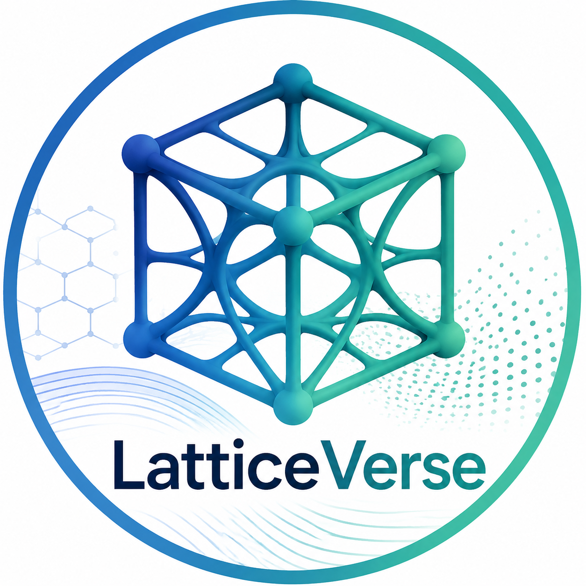
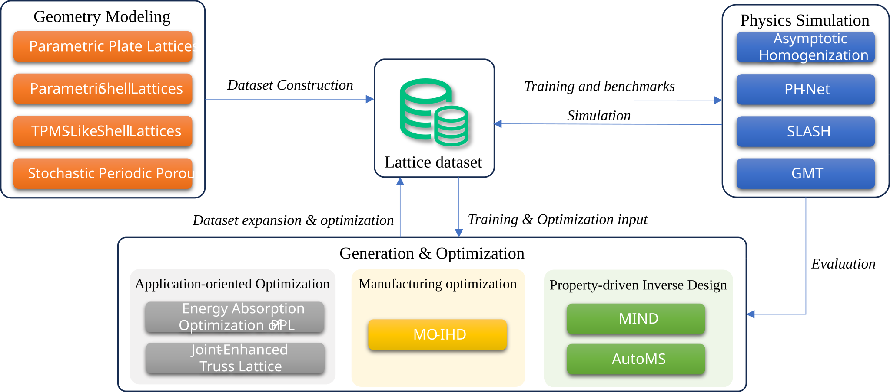

<div align="center">

  

  <p><strong>A unified research map and integration layer for computational lattice modeling, physics simulation, inverse design, and manufacturing-aware optimization.</strong></p>

[中文](README.zh-CN.md) · [Research map](#how-to-read-the-research-map) · [Projects](#1-geometry-modeling) · [Lattice dataset](#2-lattice-dataset) · [Citations](#citation)

</div>

## What this repository is

LatticeVerse is an umbrella repository for a family of lattice-design papers and their implementations. It documents how the projects connect, defines shared data and integration conventions, and links to the standalone repositories that contain the executable research code.

The repository follows one end-to-end path:

```text
geometry modeling
  -> lattice dataset
  -> physics simulation and evaluation
  -> generation and optimization
  -> verification, manufacturing, and dataset expansion
```

The common unit of exchange is a versioned lattice sample. A sample carries its geometry, material, physical fields, effective properties, design targets, optimization provenance, and manufacturing checks. This lets a generator propose a structure, a solver evaluate it, and a downstream application reproduce the decision.

Unless a project is marked as integrated, this repository does not contain its full implementation. Use the linked project repository, release, or paper for the authoritative code and experimental details.

## How to read the research map

<p align="center">
  
</p>

The map is read from left to right. Geometry Modeling produces parameterized lattice cells, which are organized into the Lattice Dataset. Physics Simulation computes local fields and effective properties, while Evaluation checks solver accuracy and candidate performance. These results provide the training and optimization inputs for three downstream branches: property-driven inverse design, application-oriented optimization, and manufacturing optimization. Accepted candidates can be verified, recorded, and fed back into the dataset for further expansion.


- Geometry Modeling supplies parameter values, canonical cell representations, and meshes or voxel references.
- Dataset Construction turns those outputs into reproducible samples with manifests, splits, and provenance.
- Simulation produces local displacement, stress, flux, or temperature fields together with effective properties.
- Evaluation compares numerical and learned solvers, checks physical consistency, and ranks generated candidates.
- Generation & Optimization consumes targets, constraints, and evaluated samples to produce new candidates.
- Verified candidates return to the dataset with their solver results, objectives, constraints, and manufacturing status.

## 1. Geometry Modeling

These projects define the controllable design space that enters the lattice dataset. Each adapter should export a canonical geometry representation and retain the parameters needed to regenerate it.

| Year / Venue | Project | What it contributes | Resources |
|:--|:--|:--|:--|
| 2023 · [AM](https://www.sciencedirect.com/journal/additive-manufacturing) | **PPL** | A unified parametric plate-lattice representation with direct quadrilateral meshing and level-set shape optimization for tailored mechanical properties. | [Paper](https://doi.org/10.1016/j.addma.2023.103626) · [Code](https://github.com/latticeverse/ParametricPlateLattice) · [Citation](docs/citations/ppl.bib) |
| 2022 · [AM](https://www.sciencedirect.com/journal/additive-manufacturing) | **PSL** | A skeleton-driven parametric shell representation with controllable topology and morphology, coupled to shape optimization for tailored elastic properties. | [Paper](https://doi.org/10.1016/j.addma.2022.103258) · [Code](https://github.com/latticeverse/ParametricShellLattice) · [Citation](docs/citations/psl.bib) |
| 2023 · [AM](https://www.sciencedirect.com/journal/additive-manufacturing) | **TPMS-like shell lattices** | Parametric shell-lattice families built from periodic boundaries and minimal-surface-like constructions, extending the accessible property space beyond classical TPMS formulas. | [Paper](https://doi.org/10.1016/j.addma.2023.103779) · [Code](https://github.com/latticeverse/TPMS-Like) · [Citation](docs/citations/tpms-like.bib) |
| 2025 · [AM](https://www.sciencedirect.com/journal/additive-manufacturing) | **SPPM** | Fabricable stochastic periodic porous microstructures generated with Wang-cube rules and Gaussian kernels, balancing randomness with periodic connectivity. | [Paper](https://doi.org/10.1016/j.addma.2025.104739) · [Citation](docs/citations/sppm.bib) · integration planned |

## 2. Lattice Dataset

The dataset layer connects geometry to the labels and metadata required by simulation, learning, and optimization.

| Dataset node | Role in the pipeline | Inputs | Outputs / resources |
|:--|:--|:--|:--|
| **Dataset Construction** | Converts generated cells into canonical, versioned samples. | Geometry parameters, cell basis, material and process metadata. | Geometry assets, sample manifest, provenance, split metadata; schema integration planned. |
| **Training and Benchmarks** | Builds comparable training and evaluation splits for generators and solvers. | Canonical samples, solver labels, target properties, and fixed random seeds. | Train/validation/test manifests, benchmark metrics, checksums, and evaluation configurations. |

This layer receives samples from Geometry Modeling and provides inputs to Physics Simulation, Evaluation, and the three optimization branches. Verified candidates return through `Dataset expansion & optimization` with their fields, properties, objectives, constraints, and manufacturing status. Dataset nodes are workflow components rather than standalone papers; cite the upstream geometry and solver papers that produced the samples.

## 3. Physics Simulation and Evaluation

Simulation is the source of physical fields and effective properties. Evaluation checks whether numerical solvers, learned surrogates, and generated candidates satisfy the same physical and numerical conventions.

| Year / Venue | Project | What it contributes | Resources |
|:--|:--|:--|:--|
| 2021 · [C&G](https://www.sciencedirect.com/journal/computers-and-graphics) | **Asymptotic Homogenization / Mechanical Property Profiles (AH / MPP)** | A deterministic reference layer for local fields, effective elastic properties, directional response, strength-related profiles, and worst-case stress under explicit boundary and material conventions. | [Paper](https://doi.org/10.1016/j.cag.2021.07.021) · [Code](https://github.com/latticeverse/AsymptoticHomogenization) · [Citation](docs/citations/ah-mpp.bib) |
| 2022 · [AM](https://www.sciencedirect.com/journal/additive-manufacturing) | **PH-Net** | A label-free 3D CNN that predicts microscopic displacement fields for general parallelepiped cells and derives local and homogenized properties from them. | [Paper](https://doi.org/10.1016/j.addma.2022.103237) · [Code](https://github.com/latticeverse/phnet) · [Citation](docs/citations/ph-net.bib) |
| 2025 · [arXiv](https://arxiv.org/abs/2506.17087) | **SLASH** | A PCG-informed sparse and periodic neural solver with multilevel structure for physically consistent homogenization at high resolutions. | [Paper](https://arxiv.org/abs/2506.17087) · [Citation](docs/citations/slash.bib) · integration planned |
| 2026 · [SIGGRAPH](https://s2026.siggraph.org/) | **GMT** | A geometric multigrid transformer that aligns sparse point-transformer blocks with multigrid hierarchies for high-fidelity elastic and thermal homogenization. | [Paper](https://arxiv.org/abs/2604.26518) · [Code](https://github.com/latticeverse/GMT) · [Citation](docs/citations/gmt.bib) |

For every solver, the evaluation record should include units, coordinate conventions, tensor ordering, boundary conditions, discretization, solver tolerance, field errors, and effective-property errors. A generated candidate is accepted only after its claims are checked through the same evaluation contract.

## 4. Generation & Optimization

The downstream branches use targets, constraints, and evaluated samples to search the design space. Each branch records the target specification, random seed, parent samples, candidate geometry, objective values, and verification results.

### 4.1 Property-driven Inverse Design

| Year / Venue | Project | What it contributes | Resources |
|:--|:--|:--|:--|
| 2025 · [SIGGRAPH](https://s2025.siggraph.org/) | **MIND** | A symmetry-aware latent-diffusion model based on Holoplane representations, jointly encoding lattice geometry and physical response to generate candidates for target properties. | [Paper](https://doi.org/10.1145/3721238.3730682) · [Code](https://github.com/latticeverse/MIND) · [Citation](docs/citations/mind.bib) |
| 2026 · [ICML](https://icml.cc/Conferences/2026) | **AutoMS** | A multi-agent neuro-symbolic system that combines simulation-aware evolutionary search with semantic task decomposition for cross-physics inverse microstructure design. | [Paper](https://arxiv.org/abs/2603.27195) · [Code](https://github.com/latticeverse/AutoMS) · [Citation](docs/citations/automs.bib) |

The input is a target property or a coupled set of physical targets. The output is a diverse set of candidate lattices with predicted properties, provenance, and a verification request for the simulation layer.

### 4.2 Application-oriented Optimization

| Year / Venue | Project | What it contributes | Resources |
|:--|:--|:--|:--|
| 2025 · [C&S](https://www.sciencedirect.com/journal/computers-and-structures) | **Energy-absorbing PPL** | An application pipeline that combines nonlinear simulation, an MLP surrogate, and NSGA-II to balance specific energy absorption against peak crushing force. | [Paper](https://doi.org/10.1016/j.compstruc.2025.107880) · [Citation](docs/citations/energy-absorbing-ppl.bib) · integration planned |
| 2025 · [M&D](https://www.sciencedirect.com/journal/materials-and-design) | **PETL (Joint-Enhanced Truss Lattice)** | A parametric joint-enhancement strategy that redistributes material near truss intersections to reduce stress concentrations and improve stiffness and strength for application loading. | [Paper](https://doi.org/10.1016/j.matdes.2025.113969) · [Citation](docs/citations/petl.bib) · [Code](https://github.com/latticeverse/JointEnhancedTrussLattice) |

This branch starts from an application objective and a high-fidelity simulation protocol. Surrogate or Pareto search proposes candidates; nonlinear simulation and physical testing determine whether they should enter the verified dataset.

### 4.3 Manufacturing Optimization

| Year / Venue | Project | What it contributes | Resources |
|:--|:--|:--|:--|
| 2026 · [JCAD](https://www.jcad.cn/) | **MAPLE** | A manufacturing-constrained inverse-homogenization pipeline with differentiable overhang, enclosed-cavity, and powder-removal constraints, using progressive Pareto-front construction to retain feasible candidates. | [Paper](https://www.jcad.cn/article/doi/10.3724/SP.J.1089.2026-00157) · [Citation](docs/citations/mo-ihd.bib) · integration planned |

The output is a manufacturable Pareto set with physical objectives and build-feasibility records, ready for mesh export, fabrication, and experimental validation. Manufacturing constraints are part of the optimization specification rather than a final repair step.


## Citation

Citation files for the projects in the map are maintained in [`docs/citations/`](docs/citations/). Use the paper entry for scientific claims and the software or dataset entry when citing a particular release. The citation index records projects whose canonical metadata is still forthcoming.

Please cite the individual paper or software release associated with every component you use. To cite the umbrella repository itself, cite the repository URL and the commit or release tag used for your work.

## License

The original documentation, schemas, configuration, and integration code in this repository are released under the [MIT License](LICENSE). See [`docs/THIRD_PARTY_NOTICES.md`](docs/THIRD_PARTY_NOTICES.md) for the current status of linked projects.

The MIT License applies only to material distributed in this repository. Linked standalone projects, papers, datasets, checkpoints, logos, and third-party assets retain their own licenses and publication terms. Some linked projects currently use CC BY-NC 4.0, while others do not yet publish a code license. A link in this README does not grant permission to copy, modify, or redistribute those materials; check each upstream project before including it in another release.

The LatticeVerse logo is a project mark and the root license does not grant trademark rights. If this repository later distributes an original dataset, figures, or other non-code material, that material should receive an explicit separate data or media license in its release metadata. The code license does not automatically cover those artifacts.
